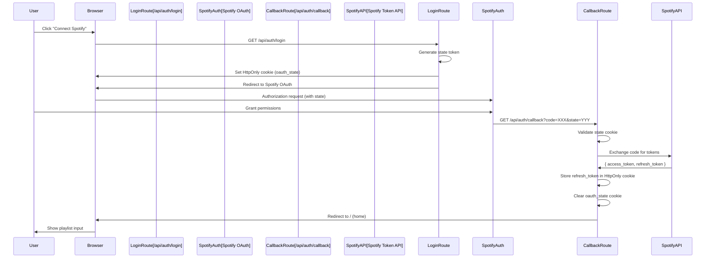
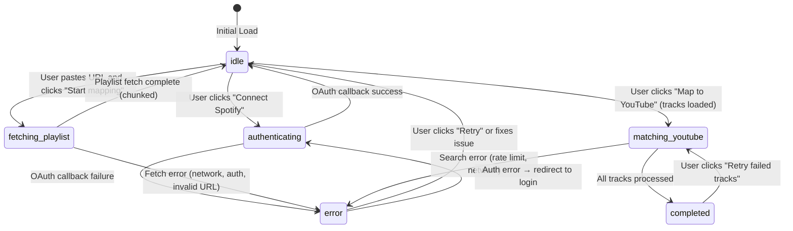

# Spotify → YouTube Playlist Mapper
## Product Requirements Document v1.0

---

## Executive Summary

### Problem Statement

Most Spotify → YouTube playlist mapping tools fail due to architectural mistakes rather than UI issues. Users experience frequent OAuth breakage, timeouts on large playlists, incorrect YouTube matches (covers, remixes, karaoke), silent rate limiting, UI freezes, and trust issues around data storage.

### Solution Overview

A **trust-first, failure-resistant SaaS micro-tool** that maps Spotify playlists to YouTube videos using a stateless, zero-cost architecture designed for Vercel serverless functions. The system prioritizes **reliability, security, and user trust** over convenience features.

### Key Differentiators

- **Stateless server architecture** - No user sessions, no database, zero infrastructure debt
- **Token safety by design** - Access tokens never stored, only refresh tokens in HttpOnly cookies
- **Timeout-proof chunking** - Playlists processed in 50-track batches, YouTube search in 10-track batches
- **Deterministic outputs** - Never throws unless auth/infra fails; missing matches are not errors
- **Zero data storage** - Nothing persisted except refresh token in secure cookie
- **Progress-driven UX** - Users see movement every 1-2 seconds, partial results appear early

---

## Architectural Principles (Non-Negotiable)

### Principle 1: Stateless Server, Stateful Client

- Server **never remembers users** between requests
- Client controls progress and retries
- Server responds fast and predictably

**Rationale**: Perfect for Vercel serverless functions. Eliminates session management complexity and scales to zero cost.

---

### Principle 2: Token Safety > Convenience

- Never store access tokens
- Refresh token only, HttpOnly cookie
- Access token lives **only in memory for a single request**

**Rationale**: Eliminates token leaks, expiry bugs, and cross-user contamination. Follows OAuth 2.0 security best practices.

---

### Principle 3: Chunk Everything

If anything can be large, **batch it**.

- Playlist fetching → batched (50 tracks max)
- YouTube matching → batched (10 tracks max, 2 concurrent)
- UI updates → incremental

**Rationale**: Prevents Vercel 10s timeouts, memory spikes, and user frustration. Users prefer slow progress over crashes.

---

### Principle 4: Deterministic Outputs

Never throw unless **auth or infra fails**.

- Missing YouTube match ≠ error
- Low confidence ≠ error
- Partial progress ≠ error

**Rationale**: Users prefer **honest incomplete results** over crashes. Trust is built through transparency.

---

### Principle 5: Zero Trust Frontend

Frontend:
- Never assumes success
- Always expects partial data
- Always recoverable

**Rationale**: Network failures are common. UI must handle partial results gracefully.

---

## User Pain Points Addressed

| Pain Point | Typical Tools | This Architecture |
|------------|--------------|-------------------|
| OAuth breaks randomly | Yes (token expiry, redirect mismatch) | No (refresh-per-call, state validation) |
| Large playlists fail halfway | Yes (timeouts) | No (chunked, offset-based) |
| Wrong YouTube matches | Yes (covers, remixes) | No (scored + filtered) |
| Rate limits silently block | Yes (no feedback) | No (explicit 429 with retry-after) |
| UI freezes while processing | Yes (single-threaded) | No (incremental updates, batching) |
| "Works locally, breaks in production" | Yes (stateful assumptions) | No (stateless by design) |
| Users don't trust tools | Yes (data storage concerns) | No (zero storage, HttpOnly cookies) |

---

## System Architecture

### High-Level Architecture

```mermaid
graph TB
    Browser[Browser Client] -->|HTTPS| NextJS[Next.js App Vercel]
    
    NextJS --> UILayer[UI Layer]
    NextJS --> APILayer[API Routes]
    NextJS --> LibLayer[Lib Layer]
    
    UILayer -->|Progress Tracking| Browser
    UILayer -->|Retry Logic| Browser
    UILayer -->|Graceful Failures| Browser
    
    APILayer --> AuthRoutes[/auth/*]
    APILayer --> PlaylistRoute[/playlist]
    APILayer --> SearchRoute[/search]
    
    LibLayer --> SpotifyLib[spotify.ts]
    LibLayer --> YouTubeLib[youtube.ts]
    LibLayer --> RateLimitLib[rateLimit.ts]
    LibLayer --> CacheLib[cache.ts]
    
    AuthRoutes --> SpotifyAPI[Spotify OAuth API]
    PlaylistRoute --> SpotifyAPI
    SpotifyLib --> SpotifyAPI
    
    SearchRoute --> YouTubeAPI[YouTube Search API]
    YouTubeLib --> YouTubeAPI
```

### Component Breakdown

#### 1. Browser (Client)
- React-based UI with state machine
- Manages authentication state via cookies
- Controls progress tracking and retries
- Handles partial results display

#### 2. Next.js App (Vercel)
- Serverless functions for API routes
- Static page generation for UI
- Cookie-based session management (refresh token only)

#### 3. UI Layer
- State machine implementation
- Progress tracking components
- Error boundaries and recovery
- Real-time result updates

#### 4. API Routes (Stateless)
- `/api/auth/login` - OAuth initiation
- `/api/auth/callback` - OAuth callback handler
- `/api/auth/refresh` - Token refresh (not used directly by frontend)
- `/api/playlist` - Chunked playlist fetching
- `/api/search` - Batch YouTube matching

#### 5. Lib Layer
- `spotify.ts` - Spotify API client, token management
- `youtube.ts` - YouTube search, scoring, filtering
- `rateLimit.ts` - IP-based rate limiting
- `cache.ts` - Best-effort in-memory cache (resets on cold start)

---

## Authentication Flow

### OAuth 2.0 Authorization Code Flow



### Security Guarantees

1. **State Validation**: CSRF protection via state token comparison
2. **HttpOnly Cookies**: JavaScript cannot access refresh token
3. **Secure Flag**: Cookies only sent over HTTPS in production
4. **SameSite: Lax**: Prevents CSRF while allowing OAuth redirects
5. **No Access Token Storage**: Access tokens exist only in memory during single request

### Token Refresh Strategy

- Access tokens are **never stored**
- Every API call that needs authentication:
  1. Reads refresh_token from HttpOnly cookie
  2. Exchanges for fresh access_token
  3. Uses access_token immediately
  4. Access_token discarded after request

**This ensures**: No token expiry bugs, no token leaks, no cross-user contamination.

---

## API Specifications

### `/api/auth/login` (GET)

**Purpose**: Initiate OAuth flow, generate CSRF state token

**Flow**:
1. Generate cryptographically secure random state token
2. Set HttpOnly cookie `oauth_state` with state value (5min TTL)
3. Build Spotify authorization URL with state parameter
4. Redirect user to Spotify OAuth

**Response**: 302 Redirect to Spotify

**Error Handling**:
- Missing `SPOTIFY_CLIENT_ID` or `REDIRECT_URI` → 500 Internal Server Error

**Security**: State token stored in HttpOnly cookie prevents CSRF attacks

---

### `/api/auth/callback` (GET)

**Purpose**: Handle OAuth callback, exchange code for tokens, store refresh token

**Query Parameters**:
- `code` - Authorization code from Spotify
- `state` - State token (must match cookie)
- `error` - Error from Spotify (optional)

**Flow**:
1. Validate `state` parameter matches `oauth_state` cookie
2. If error parameter present → redirect to `/?error={error}`
3. Exchange authorization code for tokens via Spotify API
4. Extract `refresh_token` from response
5. Set HttpOnly cookie `sp_refresh_token` (30 days TTL)
6. Clear `oauth_state` cookie
7. Redirect to `/` (home page)

**Response**: 302 Redirect to home

**Error Handling**:
- Invalid/missing state → redirect to `/?error=invalid_state`
- Missing code → redirect to `/?error=missing_code`
- Token exchange failure → redirect to `/?error=auth_failed`

**Security**: Only refresh_token stored, access_token discarded immediately

---

### `/api/auth/refresh` (POST)

**Purpose**: Exchange refresh token for access token (utility endpoint)

**Flow**:
1. Rate limit check (5 req/min per IP)
2. Extract `sp_refresh_token` from HttpOnly cookie
3. Exchange refresh_token for fresh access_token
4. Return access_token (NOT stored)

**Response**:
```json
{
  "success": true,
  "accessToken": "BQC...",
  "expiresIn": 3600
}
```

**Error Handling**:
- Rate limit exceeded → 429 with `Retry-After` header
- Missing refresh_token → 401 Unauthorized
- Refresh token expired/invalid → 401 Unauthorized

**Note**: This endpoint is primarily for utility purposes. Most API routes refresh tokens internally.

---

### `/api/playlist` (POST)

**Purpose**: Fetch Spotify playlist tracks in chunks (max 50 per request)

**Request Body**:
```json
{
  "playlistUrl": "https://open.spotify.com/playlist/37i9dQZF1DXcBWIGoYBM5M",
  "offset": 0
}
```

**Flow**:
1. Rate limit check (3 req/min per IP)
2. Extract `sp_refresh_token` from cookie
3. Exchange refresh_token for access_token
4. Extract playlist ID from URL (supports URL, URI, or raw ID)
5. Fetch playlist metadata (name, total track count)
6. Fetch tracks with offset/limit (max 50 tracks)
7. Deduplicate tracks (by name + primary artist + duration bucket)
8. Return chunk with progress metadata

**Response**:
```json
{
  "tracks": [
    {
      "name": "Song Name",
      "artists": "Artist 1, Artist 2",
      "primaryArtist": "Artist 1",
      "duration_ms": 180000,
      "spotifyUri": "spotify:track:4iV5W9uYEdYUVa79Axb7Rh"
    }
  ],
  "processed": 50,
  "total": 150,
  "done": false,
  "nextOffset": 50,
  "playlistName": "My Playlist"
}
```

**Error Handling**:
- Rate limit exceeded → 429 with `Retry-After`
- Missing refresh_token → 401 Unauthorized
- Invalid playlist URL → 400 Bad Request
- Playlist not found → 404 Not Found
- Playlist private/inaccessible → 403 Forbidden
- Expired refresh_token → 401 Unauthorized
- Server error → 500 Internal Server Error

**Chunking Strategy**: Client manages `offset`. Server returns `done: true` when `processed >= total`.

---

### `/api/search` (POST)

**Purpose**: Search YouTube for tracks, return matches with confidence scores

**Request Body**:
```json
{
  "tracks": [
    { "name": "Song Name", "artists": "Artist 1, Artist 2" }
  ]
}
```

**Flow**:
1. Rate limit check (10 req/min per IP)
2. Verify refresh_token cookie exists (authentication check)
3. Validate batch size (max 10 tracks)
4. For each track:
   - Check in-memory cache first
   - If not cached, search YouTube (concurrency: 2)
   - Apply negative keyword filtering (karaoke, cover, etc.)
   - Score results based on title match, artist match, official indicators
   - Select best match or return null if no good match
   - Cache result (24h TTL)
5. Return results in same order as input

**Response**:
```json
{
  "results": [
    {
      "track": { "name": "Song Name", "artists": "Artist 1" },
      "youtubeUrl": "https://www.youtube.com/watch?v=...",
      "title": "Song Name - Artist 1 (Official Audio)",
      "channel": "Artist 1",
      "confidence": "HIGH",
      "reason": "matched"
    }
  ],
  "cached": 2,
  "searched": 8
}
```

**Confidence Levels**:
- `HIGH`: Score ≥ 60 (strong match, title + artist match, official indicators)
- `MEDIUM`: Score 35-59 (reasonable match)
- `LOW`: Score < 35 (weak match, may be incorrect)
- `null`: No match found or filtered out

**Reasons**:
- `matched`: Found valid match
- `no_results`: No YouTube results found
- `low_confidence`: Match found but score too low
- `negative_keyword`: Results contained filtered keywords (karaoke, cover, etc.)

**Error Handling**:
- Rate limit exceeded → 429 with `Retry-After`
- Missing refresh_token → 401 Unauthorized
- Batch too large → 400 Bad Request
- Individual search failures → Swallowed, returns `null` youtubeUrl
- Server error → 500 Internal Server Error

**Note**: Individual track search failures never throw. System returns partial results.

---

## Frontend Architecture

### State Machine

```typescript
type AppState = 
  | "idle"
  | "authenticating" 
  | "fetching_playlist"
  | "matching_youtube"
  | "completed"
  | "error"
```

### State Transitions



### UI Components by State

#### `idle`
- **Not authenticated**: Login prompt with "Connect Spotify" button
- **Authenticated**: Playlist URL input, "Start mapping" button
- **Tracks loaded**: Display playlist info, "Map to YouTube" button

#### `authenticating`
- Loading spinner
- "Connecting to Spotify..." message
- Handles OAuth redirect automatically

#### `fetching_playlist`
- Progress bar (processed / total tracks)
- Batch indicator ("Batch X of Y")
- Activity log (tracks fetched so far)
- Cancel button (optional)

#### `matching_youtube`
- Progress bar (processed / total tracks)
- Real-time results table (updates as matches found)
- Confidence badges (HIGH/MEDIUM/LOW)
- Activity log (match status per track)
- Partial results visible immediately

#### `completed`
- Full results table
- Statistics (matched / total, confidence breakdown)
- Export options (copy links, generate playlist URL)
- "Retry failed tracks" button
- "Start new mapping" button

#### `error`
- Error message (user-friendly)
- Error details (for debugging, optional)
- Recovery actions:
  - "Retry" button
  - "Go back" button
  - "Report issue" link (optional)
- Context-specific guidance (e.g., "Check playlist URL format")

### Progress Tracking

**Requirements**:
- Updates every 1-2 seconds during active processing
- Shows partial results immediately
- Displays batch progress (e.g., "Processing batch 3 of 10")
- Estimated time remaining (optional)

**Implementation**:
- Frontend controls polling frequency
- Backend returns progress metadata with every response
- UI updates incrementally, never waits for complete operation

---

## Rate Limiting

### Per-Endpoint Limits

| Endpoint | Limit | Window | Rationale |
|----------|-------|--------|-----------|
| `/api/auth/refresh` | 5 req/min | 60s | Prevent token refresh abuse |
| `/api/playlist` | 3 req/min | 60s | Playlist fetching is expensive |
| `/api/search` | 10 req/min | 60s | YouTube search is rate-limited |

### Implementation

- **IP-based fingerprinting**: `sha256(ip + user-agent).slice(0, 16)`
- **In-memory store**: Resets on cold start (acceptable for MVP)
- **Explicit responses**: 429 status code with `Retry-After` header
- **Frontend handling**: Shows user-friendly message: "You've hit a temporary limit. Try again in a minute."

### Rate Limit Response Format

```json
{
  "error": "rate_limit_exceeded",
  "message": "Too many requests. Please wait.",
  "retryAfter": 45
}
```

**Headers**:
- `Retry-After: 45` (seconds until reset)
- `X-Request-Id: abc123...` (for debugging)

---

## Error Handling

### Deterministic Output Philosophy

**Never throw unless**:
1. Authentication fails (refresh token invalid/expired)
2. Infrastructure fails (Vercel error, API unreachable)

**Never throw for**:
- Missing YouTube match → Return `null` youtubeUrl
- Low confidence match → Return with `confidence: "LOW"`
- Partial progress → Return what was processed
- User input errors → Return 400 with clear message

### Error Response Format

```json
{
  "error": "error_code",
  "message": "User-friendly message",
  "retryAfter": 60  // Optional, for rate limits
}
```

**Standard Error Codes**:
- `auth_expired` - Refresh token invalid/expired
- `rate_limit_exceeded` - Too many requests
- `bad_request` - Invalid input
- `playlist_not_found` - Playlist doesn't exist
- `playlist_not_accessible` - Playlist is private
- `server_error` - Internal server error

### Frontend Error Handling

- All errors displayed with recovery actions
- Network errors → Automatic retry with exponential backoff
- Auth errors → Redirect to login
- Rate limit errors → Show countdown timer
- Partial results → Always displayed, never discarded

---

## Security Model

### Token Safety

1. **Access Tokens**: Never stored, exist only in memory during request
2. **Refresh Tokens**: Stored in HttpOnly cookie only
3. **State Tokens**: Stored in HttpOnly cookie, 5min TTL

### Cookie Security

**All cookies use**:
- `HttpOnly: true` - JavaScript cannot access
- `Secure: true` - Only sent over HTTPS (production)
- `SameSite: Lax` - CSRF protection while allowing OAuth redirects
- `Path: /` - Available to all routes

### Data Storage

**Stored**:
- Refresh token (HttpOnly cookie, 30 days)
- OAuth state (HttpOnly cookie, 5 minutes)

**Not Stored**:
- Access tokens
- User playlists
- YouTube search results (except in-memory cache, resets on cold start)
- User preferences
- Analytics data

### Privacy Guarantees

- **Zero data persistence**: No database, no file storage
- **No tracking**: No analytics, no user profiling
- **Transparent operation**: Users see exactly what data is used (playlist tracks only)
- **No sharing**: Results never sent to third parties (except Spotify/YouTube APIs)

---

## Constraints & Assumptions

### Platform Constraints

- **Vercel Serverless**: 10s timeout per function (Hobby plan)
- **No Database**: All state in cookies or client
- **No Queues**: All processing synchronous
- **No Workers**: No background jobs
- **Cold Starts**: Acceptable for MVP (cache resets on cold start)

### API Constraints

- **Spotify API**: Rate limits apply (handled gracefully)
- **YouTube API**: No official API used, using `yt-search` library (rate limits unknown)
- **Network**: All requests over HTTPS

### Assumptions

- Users have stable internet connection
- Playlists typically < 1000 tracks (chunking handles larger)
- YouTube search results are reasonably accurate
- Users understand OAuth flow

---

## Success Metrics

### Trust Indicators

- **Zero data breaches**: No tokens leaked (measured by: zero security incidents)
- **High completion rate**: Users complete mapping > 80% of the time
- **Low error rate**: < 5% of requests fail due to system errors
- **User feedback**: Positive sentiment on privacy/security

### Performance Targets

- **Playlist fetch**: < 2s per chunk (50 tracks)
- **YouTube search**: < 5s per batch (10 tracks)
- **UI responsiveness**: Updates every 1-2 seconds during processing
- **Cold start**: < 3s (Vercel serverless)

### User Experience Targets

- **Match accuracy**: > 90% HIGH confidence matches
- **Error recovery**: Users can recover from errors without restarting
- **Progress visibility**: Users see progress updates within 2 seconds
- **Documentation**: Users understand how tool works (no support requests on basics)

---

## Future Considerations (Out of Scope for v1.0)

### Potential Enhancements (Only if Needed)

- **Persistent cache**: Redis for YouTube search results (costs money)
- **Database**: User preference storage (requires paid infrastructure)
- **Queue system**: Background processing for large playlists (requires workers)
- **Official YouTube API**: Better search accuracy (requires API key, quotas)
- **Analytics**: Usage tracking (privacy trade-off)

**Decision Rule**: Only add infrastructure if users explicitly request it AND it solves a real problem.

---

## Document Version

- **Version**: 1.0
- **Date**: 2024
- **Status**: Final for MVP launch
- **Next Review**: After first 100 users

---

## Appendix

### Environment Variables

Required for production:

```env
SPOTIFY_CLIENT_ID=...
SPOTIFY_CLIENT_SECRET=...
REDIRECT_URI=https://yourdomain.com/api/auth/callback
NEXT_PUBLIC_BASE_URL=https://yourdomain.com
NODE_ENV=production
```

### API Response Examples

See `docs/api-routes.md` for detailed pseudo-code and examples.

### State Machine Implementation

See `docs/frontend-state-machine.md` for detailed state machine specification.

### Production Checklist

See `docs/production-checklist.md` for pre-launch verification steps.
