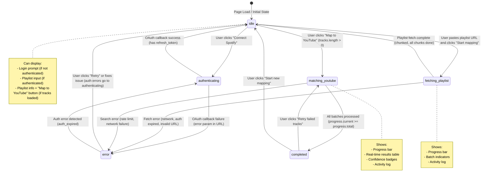

# Frontend State Machine Specification

## Overview

The frontend implements a deterministic state machine that manages the entire user journey from authentication through playlist mapping. This specification defines the state model, transitions, and UI requirements for each state.

---

## State Model

```typescript
type AppState = 
  | "idle"
  | "authenticating" 
  | "fetching_playlist"
  | "matching_youtube"
  | "completed"
  | "error"
```

### State Descriptions

| State | Description | User Action Required |
|-------|-------------|---------------------|
| `idle` | Initial state, waiting for user input | Login or paste playlist URL |
| `authenticating` | OAuth flow in progress | None (redirect handled automatically) |
| `fetching_playlist` | Fetching tracks from Spotify playlist | None (progress shown) |
| `matching_youtube` | Searching YouTube for track matches | None (progress shown) |
| `completed` | All tracks processed, results ready | Review results, retry, or start new |
| `error` | Error occurred, needs user intervention | Retry or fix issue |

---

## State Transition Diagram



---

## State Transitions (Detailed)

### Transition: `idle` → `authenticating`

**Trigger**: User clicks "Connect Spotify" button

**Action**:
```typescript
const handleLogin = () => {
  setPhase('authenticating');
  window.location.href = '/api/auth/login';
};
```

**Preconditions**: None

**Postconditions**: Browser redirects to Spotify OAuth

---

### Transition: `authenticating` → `idle`

**Trigger**: OAuth callback returns successfully (refresh_token cookie set)

**Action**:
```typescript
// Handled by useEffect on mount
useEffect(() => {
  setIsLoggedIn(document.cookie.includes('sp_refresh_token'));
  // Clear any error state
  setPhase('idle');
}, []);
```

**Preconditions**: `sp_refresh_token` cookie exists

**Postconditions**: `isLoggedIn === true`, UI shows playlist input

---

### Transition: `authenticating` → `error`

**Trigger**: OAuth callback returns with error parameter in URL

**Action**:
```typescript
useEffect(() => {
  const params = new URLSearchParams(window.location.search);
  const urlError = params.get('error');
  if (urlError) {
    setPhase('error');
    setError(urlError === 'invalid_state'
      ? 'Session expired. Please log in again.'
      : 'Authentication failed. Please try again.');
    window.history.replaceState({}, '', '/');
  }
}, []);
```

**Preconditions**: URL contains `?error=...` parameter

**Postconditions**: Error message displayed, user can retry

---

### Transition: `idle` → `fetching_playlist`

**Trigger**: User pastes playlist URL and clicks "Start mapping"

**Action**:
```typescript
const fetchPlaylist = async () => {
  // Validate URL
  if (!playlistUrl.trim() || !isValidUrl(playlistUrl)) {
    setError('Enter a valid Spotify playlist URL.');
    setPhase('error');
    return;
  }

  setPhase('fetching');
  setError('');
  setTracks([]);
  setProgress({ current: 0, total: 0 });
  
  // Chunked fetching loop
  let offset = 0;
  let allTracks: Track[] = [];
  let done = false;

  while (!done) {
    const res = await fetch('/api/playlist', {
      method: 'POST',
      headers: { 'Content-Type': 'application/json' },
      body: JSON.stringify({ playlistUrl, offset }),
    });
    
    const data = await res.json();
    if (!res.ok) {
      // Handle errors (auth_expired, etc.)
      throw new Error(data.message);
    }
    
    allTracks = [...allTracks, ...data.tracks];
    setProgress({ current: data.processed, total: data.total });
    setTracks(allTracks); // Update incrementally
    
    done = data.done;
    offset = data.nextOffset;
  }
  
  setPhase('idle'); // Back to idle, ready for YouTube mapping
};
```

**Preconditions**: 
- `isLoggedIn === true`
- `playlistUrl` is valid Spotify URL

**Postconditions**: 
- `tracks` array populated
- `playlistName` set
- Progress metadata updated

---

### Transition: `fetching_playlist` → `error`

**Trigger**: API call fails (network, auth, invalid URL, etc.)

**Action**:
```typescript
catch (err) {
  setError(err instanceof Error ? err.message : 'Unexpected error.');
  setPhase('error');
  
  // Check if auth error
  if (data?.error === 'auth_expired') {
    setIsLoggedIn(false);
    // Will transition to authenticating on retry
  }
}
```

**Preconditions**: Error thrown during playlist fetch

**Postconditions**: Error message displayed, user can retry

---

### Transition: `idle` → `matching_youtube`

**Trigger**: User clicks "Map to YouTube" button (tracks loaded)

**Action**:
```typescript
const mapToYouTube = async () => {
  if (tracks.length === 0) return;

  setPhase('matching');
  setError('');
  setResults(new Map());
  setProgress({ current: 0, total: tracks.length });

  const BATCH_SIZE = 10;
  const newResults = new Map<string, SearchResult>();

  for (let i = 0; i < tracks.length; i += BATCH_SIZE) {
    const batch = tracks.slice(i, i + BATCH_SIZE);
    
    const res = await fetch('/api/search', {
      method: 'POST',
      headers: { 'Content-Type': 'application/json' },
      body: JSON.stringify({
        tracks: batch.map(t => ({ name: t.name, artists: t.artists }))
      }),
    });

    const data = await res.json();
    if (!res.ok) {
      throw new Error(data.message);
    }

    // Update results incrementally
    for (const result of data.results) {
      const key = getTrackKey(result.track);
      newResults.set(key, result);
    }
    
    setResults(new Map(newResults)); // Trigger re-render
    setProgress({ current: Math.min(i + BATCH_SIZE, tracks.length), total: tracks.length });
  }

  setPhase('completed');
};
```

**Preconditions**: 
- `tracks.length > 0`
- `isLoggedIn === true`

**Postconditions**: 
- `results` Map populated with YouTube matches
- Progress complete

---

### Transition: `matching_youtube` → `completed`

**Trigger**: All batches processed (`progress.current >= progress.total`)

**Action**: Automatically set `setPhase('completed')`

**Preconditions**: Last batch processed successfully

**Postconditions**: All results available, statistics calculated

---

### Transition: `matching_youtube` → `error`

**Trigger**: API call fails (rate limit, network, etc.)

**Action**: Similar to `fetching_playlist` → `error`

**Preconditions**: Error thrown during YouTube search

**Postconditions**: Partial results preserved, error message displayed

---

### Transition: `completed` → `matching_youtube`

**Trigger**: User clicks "Retry failed tracks" button

**Action**:
```typescript
const retryFailed = () => {
  const failedTracks = tracks.filter(t => {
    const result = results.get(getTrackKey(t));
    return !result?.youtubeUrl;
  });
  
  setTracks(failedTracks); // Filter to only failed tracks
  setPhase('matching'); // Start matching again
};
```

**Preconditions**: Some tracks failed to match (no `youtubeUrl`)

**Postconditions**: Only failed tracks reprocessed

---

### Transition: `completed` → `idle`

**Trigger**: User clicks "Start new mapping" button

**Action**:
```typescript
const startNew = () => {
  setTracks([]);
  setResults(new Map());
  setPlaylistUrl('');
  setPlaylistName('');
  setProgress({ current: 0, total: 0 });
  setPhase('idle');
};
```

**Preconditions**: None

**Postconditions**: All state reset, ready for new playlist

---

### Transition: `error` → `idle`

**Trigger**: User clicks "Retry" button (non-auth errors)

**Action**:
```typescript
const handleRetry = () => {
  setError('');
  setPhase('idle');
  // Previous action will be retried (e.g., fetchPlaylist, mapToYouTube)
};
```

**Preconditions**: Error is recoverable (not auth error)

**Postconditions**: Error cleared, ready to retry previous action

---

### Transition: `error` → `authenticating`

**Trigger**: Auth error detected (`auth_expired`)

**Action**:
```typescript
if (data?.error === 'auth_expired') {
  setIsLoggedIn(false);
  setPhase('authenticating');
  window.location.href = '/api/auth/login';
}
```

**Preconditions**: Error is `auth_expired`

**Postconditions**: Redirects to login flow

---

## UI Components by State

### State: `idle`

**When not authenticated**:
- Login prompt card
- "Connect Spotify" button (Spotify icon)
- Brief explanation: "Uses Spotify OAuth. Read-only, no tokens stored client-side."
- Link to privacy policy

**When authenticated, no tracks**:
- Playlist URL input field
- "Start mapping" button (disabled until valid URL)
- URL format hint: "https://open.spotify.com/playlist/..."
- Connection status indicator (green dot + "Spotify: Connected")

**When authenticated, tracks loaded**:
- Playlist info card (name, track count)
- "Map to YouTube" button
- Option to clear and start new playlist

---

### State: `authenticating`

**UI Elements**:
- Loading spinner (animated)
- Message: "Connecting to Spotify..."
- Disabled state (no user actions available)
- Auto-redirect handling (browser navigates to Spotify)

**Technical Note**: This state is brief, mainly shown during OAuth redirect. Most time is spent on Spotify's OAuth page.

---

### State: `fetching_playlist`

**UI Elements**:

1. **Progress Bar**:
   - Shows: `processed / total` tracks
   - Percentage: `(processed / total) * 100`
   - Visual indicator with animation

2. **Batch Indicator**:
   - Text: "Batch X of Y" (calculated from offset)
   - Status badge: "Fetching playlist" (blue)

3. **Activity Log**:
   - Scrollable log container
   - Entries: "Fetched X / Y tracks" (updated per chunk)
   - Max height, auto-scroll to bottom

4. **Playlist Info** (partial, as available):
   - Playlist name (once first chunk returns)
   - Current track count (incremental)

**User Actions**:
- None (automatic process)
- Option to cancel (future enhancement)

**Update Frequency**: Every chunk fetch (approximately every 1-2 seconds for large playlists)

---

### State: `matching_youtube`

**UI Elements**:

1. **Progress Bar**:
   - Shows: `processed / total` tracks
   - Percentage: `(processed / total) * 100`
   - Visual indicator with animation

2. **Batch Indicator**:
   - Text: "Processing batch X of Y"
   - Status badge: "Searching YouTube" (purple/pink gradient)

3. **Results Table** (real-time updates):
   - Columns: #, Track Name, Artist, YouTube Link, Confidence, Status
   - Rows added/updated as matches found
   - Scrollable, max height
   - Confidence badges: HIGH (green), MEDIUM (amber), LOW (gray)
   - Status icons: ✓ (matched), ⚠ (low confidence), ○ (not found)

4. **Activity Log**:
   - Entries: "✓ Song Name" or "○ Song Name" or "⚠ Song Name"
   - Updated per track processed
   - Max height, auto-scroll

5. **Statistics** (side panel):
   - Matched: X
   - No match: Y
   - High confidence: Z
   - Medium confidence: W
   - Low confidence: V

**User Actions**:
- None (automatic process)
- Results visible immediately (partial)

**Update Frequency**: Every batch (approximately every 2-5 seconds)

---

### State: `completed`

**UI Elements**:

1. **Results Table** (complete):
   - All tracks with match status
   - Sortable columns (optional)
   - Filter by confidence level (optional)
   - Export options (copy links, generate playlist URL)

2. **Statistics Card**:
   - Total tracks
   - Matched / Not matched
   - Confidence breakdown (HIGH/MEDIUM/LOW counts)
   - Success rate percentage

3. **Action Buttons**:
   - "Retry failed tracks" (only if some failed)
   - "Start new mapping"
   - "Export results" (copy to clipboard, generate YouTube playlist URL)

4. **Completion Message**:
   - "Mapping complete! X of Y tracks matched."

**User Actions**:
- Review results
- Retry failed tracks
- Export/share results
- Start new mapping

---

### State: `error`

**UI Elements**:

1. **Error Message Card**:
   - Error title (user-friendly)
   - Error details (technical, optional/collapsible)
   - Error code (for support/debugging)

2. **Recovery Actions**:
   - "Retry" button (primary action)
   - "Go back" button (return to previous state)
   - Context-specific guidance:
     - Invalid URL → "Check playlist URL format"
     - Rate limit → "Wait X seconds and try again"
     - Auth expired → "Please log in again"

3. **Error Context**:
   - What operation was being performed
   - Progress made before error (if applicable)
   - Partial results (preserved, not discarded)

**Error Types & Handling**:

| Error Code | User Message | Recovery Action |
|------------|--------------|-----------------|
| `auth_expired` | "Session expired. Please log in again." | Redirect to login |
| `rate_limit_exceeded` | "Too many requests. Please wait X seconds." | Show countdown, retry button |
| `playlist_not_found` | "Playlist not found. Check the URL." | Allow URL edit, retry |
| `network_error` | "Network error. Please check your connection." | Retry button |
| `server_error` | "Something went wrong. Please try again." | Retry button |

**User Actions**:
- Retry (most errors)
- Go back (all errors)
- Report issue (optional, links to GitHub/issues)

---

## Progress Tracking Requirements

### Update Frequency

- **Minimum**: Every 1-2 seconds during active processing
- **Maximum**: Every batch/chunk completion

### Progress Metadata

Each API response includes:
```typescript
{
  processed: number,  // Tracks processed so far
  total: number,      // Total tracks in playlist
  done: boolean       // Whether all chunks/batches complete
}
```

### UI Display

1. **Progress Bar**:
   - Visual bar with percentage
   - Smooth animation (CSS transition)
   - Color coding: blue (fetching), purple (matching), green (complete)

2. **Text Indicators**:
   - "Processed X of Y tracks"
   - Percentage: "XX%"
   - Batch/Chunk: "Batch X of Y"

3. **Estimated Time** (optional):
   - Calculate: `(total - processed) * averageTimePerItem`
   - Display: "Approximately X seconds remaining"

### Incremental Updates

- **Playlist Fetching**: Tracks array updated per chunk
- **YouTube Matching**: Results Map updated per batch
- **UI Re-renders**: Triggered by state updates, React handles efficiently

---

## Component Architecture

### Main State Container

**File**: `app/page.tsx`

**Responsibilities**:
- State machine state management
- API call orchestration
- Progress tracking
- Error handling
- State transitions

**Key Hooks**:
```typescript
const [phase, setPhase] = useState<AppState>('idle');
const [progress, setProgress] = useState({ current: 0, total: 0 });
const [error, setError] = useState('');
const [tracks, setTracks] = useState<Track[]>([]);
const [results, setResults] = useState<Map<string, SearchResult>>(new Map());
```

### Reusable Components

1. **ProgressBar** (`components/ProgressBar.tsx`):
   - Props: `current`, `total`, `phase`, `label`
   - Displays progress bar with percentage
   - Color-coded by phase

2. **ResultsTable** (`components/ResultsTable.tsx`):
   - Props: `tracks`, `results`, `onRetryFailed`
   - Displays track-to-YouTube mapping table
   - Handles real-time updates

3. **ActivityLog** (`components/ActivityLog.tsx`):
   - Props: `logs` (string array)
   - Scrollable log container
   - Auto-scroll to bottom

4. **ErrorCard** (`components/ErrorCard.tsx`):
   - Props: `error`, `onRetry`, `onGoBack`
   - Displays error message and recovery actions
   - Context-specific guidance

5. **ConfidenceBadge** (`components/ConfidenceBadge.tsx`):
   - Props: `confidence: 'HIGH' | 'MEDIUM' | 'LOW' | null`
   - Color-coded badge component

---

## Implementation Notes

### State Persistence

- **No persistence**: State resets on page refresh
- **Cookie-based auth**: `sp_refresh_token` persists (30 days)
- **URL state**: OAuth errors passed via URL params (cleared after handling)

### Error Recovery

- **Partial results preserved**: Never discard progress on error
- **Retry mechanism**: User-initiated, preserves context
- **Network resilience**: Automatic retry with exponential backoff (future enhancement)

### Performance Considerations

- **Batch updates**: Update state after each batch, not per item
- **Memoization**: Use `useMemo` for derived state (statistics, filtered results)
- **Virtual scrolling**: For large result tables (100+ tracks, future enhancement)

---

## Testing Scenarios

### State Transition Tests

1. **idle → authenticating → idle**: Complete OAuth flow
2. **idle → fetching_playlist → idle**: Fetch playlist successfully
3. **idle → fetching_playlist → error**: Handle fetch error
4. **idle → matching_youtube → completed**: Complete mapping
5. **completed → matching_youtube**: Retry failed tracks
6. **error → idle**: Recover from error

### Edge Cases

1. **Network interruption**: Partial progress preserved
2. **Rate limiting**: Error state with retry countdown
3. **Large playlists** (500+ tracks): Chunked fetching works
4. **No matches found**: Completed state with 0 matches
5. **Auth expiration mid-operation**: Error state, redirect to login

---

## References

- Current implementation: `app/page.tsx`
- API routes: `app/api/**/route.ts`
- Type definitions: `types.d.ts`
- PRD: `PRD.md` (Section: Frontend Architecture)