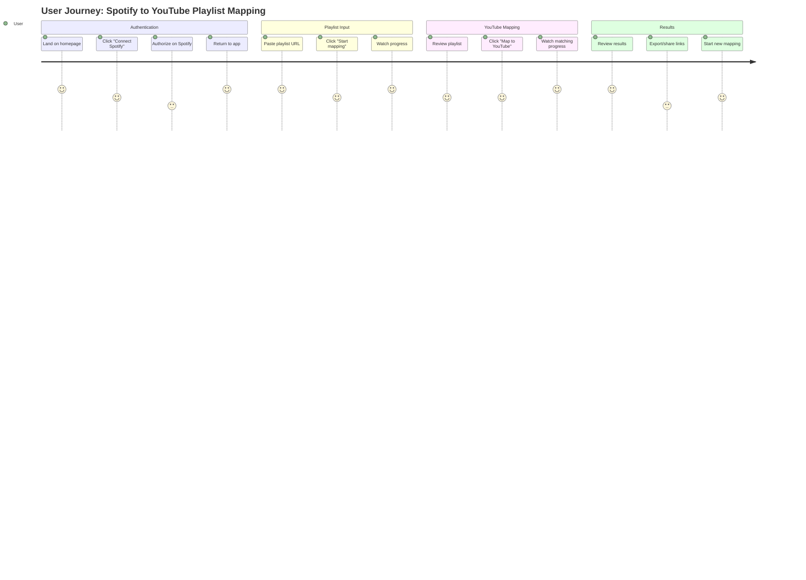
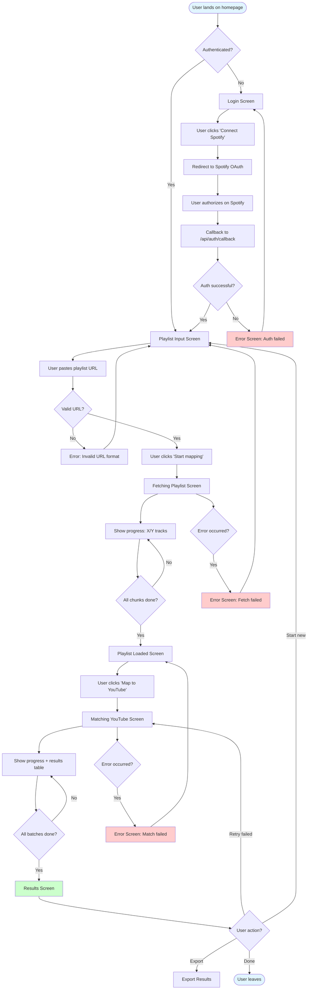
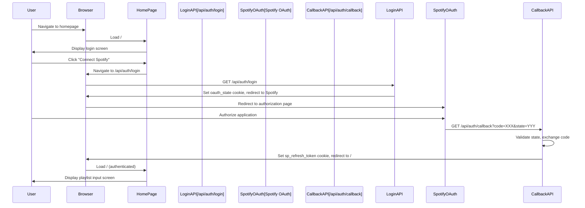
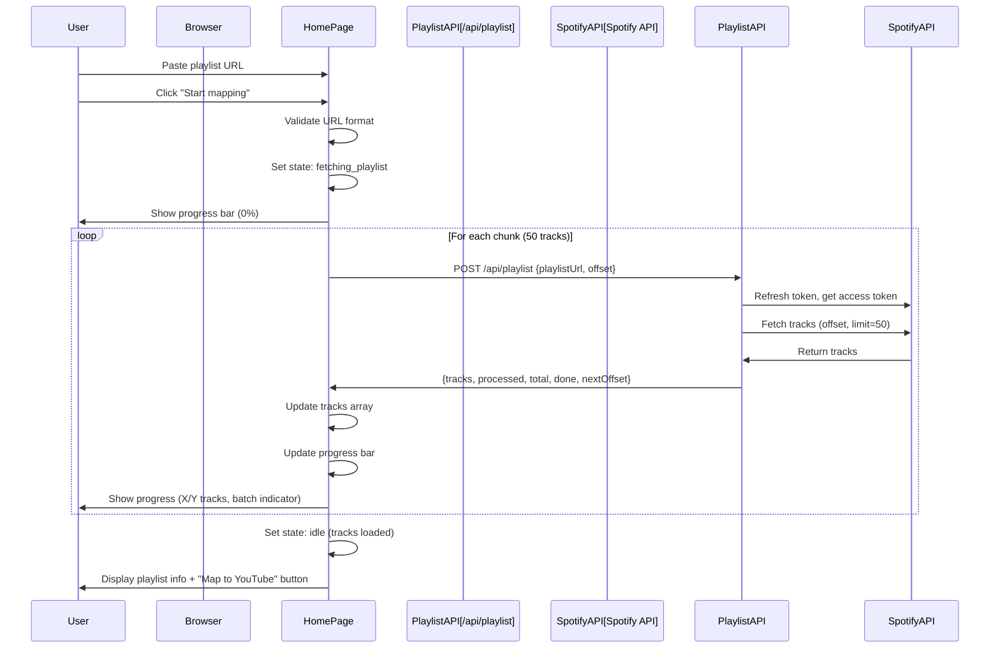
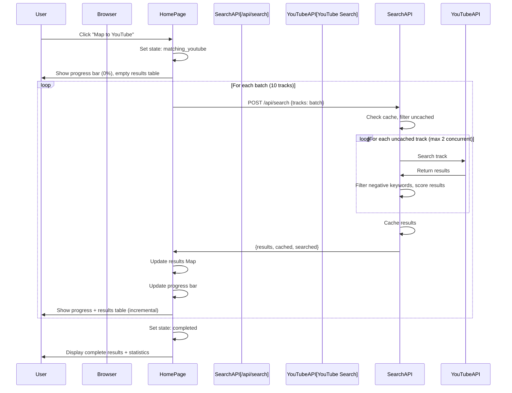
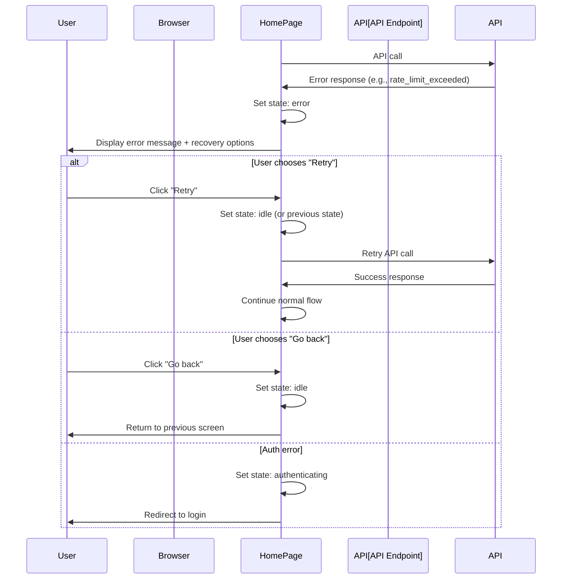

# UI Flow & User Journey

## Overview

This document describes the user journey through the Spotify → YouTube Playlist Mapper application, including screen flows, user interactions, and decision points.

---

## High-Level User Journey



---

## Screen Flow Diagram



---

## Detailed Screen Flows

### Flow 1: First-Time User (Not Authenticated)



**Screen States**:
1. **Initial**: Login screen with "Connect Spotify" button
2. **Redirecting**: Brief loading state (handled by browser redirect)
3. **Authenticated**: Playlist input screen

---

### Flow 2: Authenticated User - Playlist Fetching



**Screen States**:
1. **Before**: Playlist input screen
2. **During**: Fetching screen with progress bar, batch indicators, activity log
3. **After**: Playlist loaded screen with track count and "Map to YouTube" button

**Progress Updates**: Every chunk (approximately every 1-2 seconds for large playlists)

---

### Flow 3: YouTube Matching



**Screen States**:
1. **Before**: Playlist loaded screen
2. **During**: Matching screen with progress bar, real-time results table, activity log
3. **After**: Completed screen with full results, statistics, export options

**Progress Updates**: Every batch (approximately every 2-5 seconds)

**Real-Time Updates**: Results table updates incrementally as matches are found

---

### Flow 4: Error Recovery



**Error Types & Recovery**:

| Error | Screen | Recovery Options |
|-------|--------|-----------------|
| `auth_expired` | Error screen | Redirect to login (automatic) |
| `rate_limit_exceeded` | Error screen with countdown | Wait and retry |
| `playlist_not_found` | Error screen | Edit URL, retry |
| `network_error` | Error screen | Retry button |
| `server_error` | Error screen | Retry button |

---

## User Interaction Patterns

### Pattern 1: Progressive Disclosure

**Principle**: Show information incrementally as it becomes available.

**Examples**:
- Playlist name appears after first chunk fetched
- Results table populates incrementally during matching
- Statistics update as results come in

**Benefits**: Users see progress immediately, no "blank screen" anxiety

---

### Pattern 2: Optimistic Updates

**Principle**: Update UI immediately, handle errors gracefully.

**Examples**:
- Progress bar updates before API response confirms
- Results appear in table as soon as received
- Error states preserve partial progress

**Benefits**: Perceived performance improvement, users see movement

---

### Pattern 3: Clear Feedback

**Principle**: Always inform users of current state and next steps.

**Examples**:
- Progress indicators: "Processing batch 3 of 10"
- Status badges: "Fetching playlist", "Searching YouTube", "Done"
- Activity logs: "✓ Song Name", "○ Song Name (not found)"

**Benefits**: Users understand what's happening, reduces confusion

---

### Pattern 4: Graceful Degradation

**Principle**: Handle failures without losing progress.

**Examples**:
- Network error → Partial results preserved, error message shown
- Rate limit → Show countdown, allow retry
- Auth expiration → Preserve playlist data, redirect to login

**Benefits**: Users don't lose work, trust in system reliability

---

## Screen Mockups (Text-Based)

### Screen 1: Login Screen

```
┌─────────────────────────────────────────┐
│  Spotify → YouTube Playlist Mapper      │
├─────────────────────────────────────────┤
│                                         │
│         [Connect Spotify Button]        │
│              (Spotify Icon)             │
│                                         │
│  Uses Spotify OAuth. Read-only, no     │
│  tokens stored client-side.             │
│                                         │
│  [Privacy Policy] [Terms of Service]    │
│                                         │
│  How it works:                          │
│  1. Connect your Spotify account       │
│  2. Paste your playlist URL            │
│  3. Get YouTube links for all tracks   │
│                                         │
└─────────────────────────────────────────┘
```

---

### Screen 2: Playlist Input Screen

```
┌─────────────────────────────────────────┐
│  ✓ Spotify: Connected                  │
├─────────────────────────────────────────┤
│                                         │
│  Spotify Playlist URL                   │
│  ┌───────────────────────────────────┐ │
│  │ https://open.spotify.com/playlist/│ │
│  └───────────────────────────────────┘ │
│                    [Start mapping] →   │
│                                         │
│  Example: https://open.spotify.com/    │
│           playlist/37i9dQZF1DXcBWIG... │
│                                         │
└─────────────────────────────────────────┘
```

---

### Screen 3: Fetching Playlist Screen

```
┌─────────────────────────────────────────┐
│  Fetching Playlist                      │
├─────────────────────────────────────────┤
│                                         │
│  Progress: 150 / 500 tracks (30%)      │
│  ████████░░░░░░░░░░░░░░░░░░░░░░░░      │
│                                         │
│  Batch 3 of 10                         │
│  Status: [Fetching playlist]           │
│                                         │
│  Activity Log:                          │
│  ┌───────────────────────────────────┐ │
│  │ Fetched 50 / 500 tracks           │ │
│  │ Fetched 100 / 500 tracks          │ │
│  │ Fetched 150 / 500 tracks          │ │
│  └───────────────────────────────────┘ │
│                                         │
└─────────────────────────────────────────┘
```

---

### Screen 4: Matching YouTube Screen

```
┌─────────────────────────────────────────┐
│  Searching YouTube                      │
├─────────────────────────────────────────┤
│                                         │
│  Progress: 30 / 100 tracks (30%)       │
│  ████████░░░░░░░░░░░░░░░░░░░░░░░░░░    │
│                                         │
│  Batch 3 of 10                         │
│  Status: [Searching YouTube]           │
│                                         │
│  Results (30/100):                      │
│  ┌───────────────────────────────────┐ │
│  │ # Track        YouTube  Conf.     │ │
│  │ 1 Song A       [Link]   [HIGH]    │ │
│  │ 2 Song B       [Link]   [MEDIUM]  │ │
│  │ 3 Song C       -        -         │ │
│  │ ...                                │ │
│  └───────────────────────────────────┘ │
│                                         │
│  Activity Log:                          │
│  ┌───────────────────────────────────┐ │
│  │ ✓ Song A                          │ │
│  │ ⚠ Song B (low confidence)         │ │
│  │ ○ Song C (not found)              │ │
│  └───────────────────────────────────┘ │
│                                         │
└─────────────────────────────────────────┘
```

---

### Screen 5: Results Screen

```
┌─────────────────────────────────────────┐
│  Mapping Complete!                      │
├─────────────────────────────────────────┤
│                                         │
│  Statistics:                            │
│  • Total: 100 tracks                   │
│  • Matched: 85 (85%)                   │
│  • Not found: 15 (15%)                 │
│  • High confidence: 70                 │
│  • Medium confidence: 10               │
│  • Low confidence: 5                   │
│                                         │
│  Results:                               │
│  ┌───────────────────────────────────┐ │
│  │ # Track        YouTube  Conf.     │ │
│  │ [Full results table...]           │ │
│  └───────────────────────────────────┘ │
│                                         │
│  [Retry failed tracks] [Export]        │
│  [Start new mapping]                   │
│                                         │
└─────────────────────────────────────────┘
```

---

### Screen 6: Error Screen

```
┌─────────────────────────────────────────┐
│  Error                                  │
├─────────────────────────────────────────┤
│                                         │
│  ⚠ Rate limit exceeded                 │
│                                         │
│  Too many requests. Please wait 45      │
│  seconds and try again.                 │
│                                         │
│  Error code: rate_limit_exceeded        │
│                                         │
│  [Retry in 45s] [Go back]              │
│                                         │
│  Note: Your progress has been saved.   │
│  You can continue from where you left  │
│  off once the rate limit resets.       │
│                                         │
└─────────────────────────────────────────┘
```

---

## Accessibility Considerations

### Keyboard Navigation

- All interactive elements focusable via Tab
- Enter/Space activates buttons
- Escape closes modals/overlays (future)

### Screen Readers

- Progress bars include `aria-valuenow`, `aria-valuemin`, `aria-valuemax`
- Status messages announced via `aria-live` regions
- Error messages clearly labeled
- Links have descriptive text

### Visual Design

- High contrast for text (WCAG AA compliant)
- Color not sole indicator (icons + text for status)
- Focus indicators visible
- Responsive design (mobile-friendly)

---

## Performance Considerations

### Loading States

- Skeleton screens for initial load (future enhancement)
- Progressive image loading (if thumbnails added)
- Lazy loading for results table (virtual scrolling for 100+ tracks)

### Update Frequency

- Progress updates: Maximum every 1-2 seconds
- Results table: Update per batch (not per track)
- Activity log: Update per track (but limit to last 50 entries)

### Network Optimization

- Batch API calls (10 tracks per search request)
- Cache results (24h TTL)
- Retry with exponential backoff (future enhancement)

---

## References

- State Machine: `docs/frontend-state-machine.md`
- API Routes: `docs/api-routes.md`
- PRD: `PRD.md`
- Current Implementation: `app/page.tsx`
